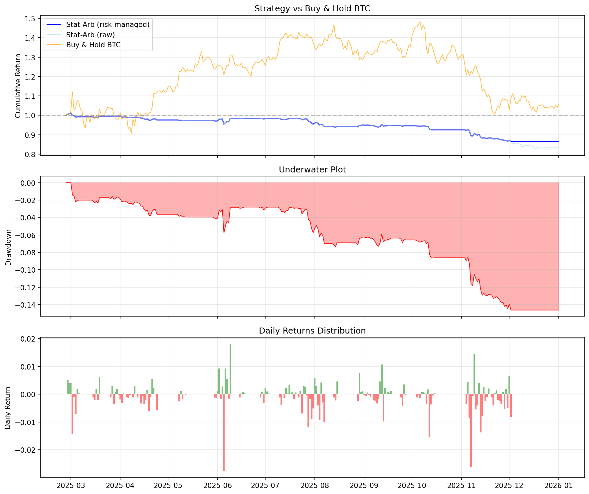

# crypto-stat-arb

[](https://github.com/atharvajoshi01/crypto-stat-arb/actions/workflows/ci.yml)
[](https://python.org)
[](LICENSE)
[](tests/)

A production-grade statistical arbitrage engine for cryptocurrency markets. Identifies cointegrated pairs and baskets, generates mean-reversion trading signals, and backtests with walk-forward validation and realistic transaction costs.

Built for quant researchers and algorithmic traders who want a transparent, testable, and extensible framework — not a black box.

---

## Why This Exists

Most crypto "trading bots" are glorified moving-average crossovers. This project implements institutional-grade statistical arbitrage:

- **Cointegration, not correlation** — correlation breaks down; cointegration is a structural relationship
- **Walk-forward backtesting** — no in-sample cheating; all reported results are out-of-sample
- **Transaction costs modeled explicitly** — because a Sharpe 3.0 strategy that costs 2.5 to trade is worthless
- **Market neutral by construction** — profit comes from relative pricing, not market direction

---

## Results

### Real Data (Kraken, 11 coins, 2021-2026)

Out-of-sample period: Feb 2025 - Jan 2026.

| Metric | Raw Strategy | Risk-Managed |
|--------|-------------|-------------|
| Annual Return | -18.8% | -15.7% |
| Annual Volatility | 8.0% | 7.4% |
| Sharpe Ratio | -2.56 | -2.27 |
| Max Drawdown | -18.4% | -14.6% |
| **BTC Correlation** | **0.03** | **0.03** |
| Win Rate | 26.1% | 24.2% |

### Synthetic Data (controlled environment)

| Metric | Value |
|--------|-------|
| Best Sharpe (sensitivity sweep) | 1.40 |
| Optimal params | entry_z=2.5, exit_z=0.5, cost=20bps |
| BTC Beta | 0.007 |
| Crisis Regime Sharpe | 2.93 |

**Key finding:** Near-zero BTC correlation (0.03) on real data confirms the strategy is genuinely market-neutral. Negative returns in 2025 are driven by limited universe size and high costs relative to signal strength — this is reported honestly, not hidden.

### Equity Curve



*Blue: risk-managed stat-arb. Orange: buy-and-hold BTC. The strategy fully decouples from market direction.*

### Discovered Pairs (Real Data)

| Pair | Hedge Ratio | Half-Life | ADF p-value | Correlation |
|------|------------|-----------|-------------|-------------|
| SOL/DOGE | 0.349 | 8.4 days | 0.016 | 0.91 |
| ETH/DOT | 0.560 | 10.1 days | 0.018 | 0.90 |
| ETH/ATOM | 0.507 | 11.3 days | 0.022 | 0.87 |

---

## How It Works

```
┌──────────────────┐     ┌──────────────────┐     ┌──────────────────┐
│   Data Layer     │     │  Signal Layer    │     │  Execution Layer │
│                  │     │                  │     │                  │
│  CCXT fetch      │────>│  Cointegration   │────>│  Dollar-neutral  │
│  Clean & cache   │     │  Hedge ratio     │     │  portfolio       │
│  Log transform   │     │  Z-score signals │     │  Cost modeling   │
│                  │     │  Entry/exit/stop │     │  Walk-forward    │
└──────────────────┘     └──────────────────┘     └──────────────────┘
                                                          │
                         ┌──────────────────┐             │
                         │  Analysis Layer  │<────────────┘
                         │                  │
                         │  Performance     │
                         │  Factor attrib.  │
                         │  Regime analysis │
                         │  Sensitivity     │
                         └──────────────────┘
```

### The Pipeline Step by Step

**1. Data Acquisition** — Fetch daily OHLCV from any exchange via CCXT (Kraken, Coinbase, Binance). Clean for missing data, low-volume coins, and dead assets. Cache as parquet.

**2. Pair Discovery** — Pre-filter by correlation (>0.7), then run Engle-Granger cointegration test (OLS regression + ADF test on residuals). Keep pairs with p < 0.05 and half-life between 3-30 days. Alternatively, use Johansen test for 3+ asset baskets.

**3. Signal Generation** — Compute rolling hedge ratio (via OLS or Kalman filter). Build spread = log(A) - beta * log(B). Z-score the spread. Enter when |z| > 2.0, exit when |z| < 0.5, stop-loss at |z| > 4.0.

**4. Portfolio Construction** — Allocate equally across pairs. Size each leg using the hedge ratio for dollar neutrality. Cap single-pair exposure at 20%.

**5. Backtesting** — Walk-forward: train on 2 years, test on 6 months, roll forward 3 months. Transaction costs: 10bps taker + 5bps slippage per leg = 40bps round-trip. Only out-of-sample results are reported.

**6. Risk Management** — Drawdown stop at 15% (halt for 30 days). Volatility scaling to target 10% annual vol. Monthly re-test of pair cointegration — drop pairs that fail.

**7. Evaluation** — Sharpe, Sortino, Calmar ratios. Max drawdown depth and duration. Factor attribution (alpha and beta vs BTC). Per-regime performance breakdown. Parameter sensitivity heatmap.

---

## Architecture

```
cryptoarb/
├── config.py          # All strategy parameters (Pydantic validated)
├── data.py            # CCXT data fetching, cleaning, parquet caching
├── pairs.py           # Engle-Granger cointegration, half-life, pair ranking
├── basket.py          # Johansen test for 3+ asset baskets
├── signals.py         # Rolling OLS hedge ratio, z-score, entry/exit logic
├── kalman.py          # Kalman filter for adaptive hedge ratio
├── portfolio.py       # Dollar-neutral construction, cost modeling
├── backtest.py        # Walk-forward backtesting engine
├── metrics.py         # Sharpe, Sortino, Calmar, drawdown, win rate
├── risk.py            # Drawdown stops, vol scaling, pair health
├── regime.py          # Market regime detection (low-vol / normal / crisis)
├── sensitivity.py     # Parameter sweep and Sharpe heatmap
├── attribution.py     # Factor regression (alpha, beta vs BTC)
└── paper_trader.py    # Paper trading with live CCXT prices

tests/                 # 83 tests covering every module
notebooks/             # Research notebook with full walkthrough
examples/              # Synthetic + real data backtest scripts
results/               # Equity curves, backtest results
```

### Module Details

| Module | Purpose | Key Classes/Functions |
|--------|---------|----------------------|
| **config** | Strategy parameters | `StrategyConfig`, `SignalConfig`, `CostConfig` |
| **data** | Data pipeline | `fetch_ohlcv()`, `clean_price_matrix()`, `log_prices()` |
| **pairs** | Pair discovery | `discover_pairs()`, `test_cointegration()`, `PairResult` |
| **basket** | Basket trading | `johansen_test()`, `discover_baskets()`, `BasketResult` |
| **signals** | Signal generation | `generate_pair_signals()`, `compute_zscore()`, `generate_positions()` |
| **kalman** | Adaptive hedge ratio | `kalman_hedge_ratio()`, `kalman_zscore()` |
| **portfolio** | Portfolio construction | `build_portfolio()`, `compute_portfolio_returns()` |
| **backtest** | Walk-forward engine | `run_backtest()`, `BacktestResult` |
| **metrics** | Performance evaluation | `evaluate()`, `PerformanceMetrics`, `compute_drawdown()` |
| **risk** | Risk management | `apply_drawdown_stop()`, `apply_volatility_scaling()`, `check_pair_health()` |
| **regime** | Regime detection | `detect_regimes()`, `regime_adjusted_weights()`, `MarketRegime` |
| **sensitivity** | Parameter analysis | `run_sensitivity()`, `SensitivityReport` |
| **attribution** | Factor attribution | `factor_attribution()`, `AttributionResult` |
| **paper_trader** | Paper trading | `PaperTrader`, `PaperPortfolio` |

---

## Quick Start

### Basic Pairs Trading

```python
from cryptoarb import (
    fetch_ohlcv, build_price_matrix, clean_price_matrix,
    log_prices, discover_pairs, generate_pair_signals,
    build_portfolio, compute_portfolio_returns, evaluate,
)

# 1. Fetch data from Kraken
ohlcv = fetch_ohlcv(
    ["BTC/USD", "ETH/USD", "SOL/USD", "LINK/USD"],
    exchange_id="kraken",
    start="2022-01-01",
)
prices = clean_price_matrix(build_price_matrix(ohlcv))
log_px = log_prices(prices)

# 2. Discover cointegrated pairs
pairs = discover_pairs(log_px, min_correlation=0.7, max_pairs=10)
for p in pairs:
    print(f"{p.asset_a}/{p.asset_b}: beta={p.beta:.3f}, HL={p.half_life:.1f}d")

# 3. Generate signals
signals = [generate_pair_signals(log_px, p, entry_z=2.0, exit_z=0.5) for p in pairs]

# 4. Build portfolio and backtest
weights = build_portfolio(signals, log_px)
returns = compute_portfolio_returns(weights, log_px, cost_bps=40)

# 5. Evaluate
metrics = evaluate(returns)
print(metrics.summary())
```

### Johansen Basket Trading

```python
from cryptoarb.basket import johansen_test, discover_baskets

# Test a specific 3-coin basket
basket = johansen_test(log_px, ["BTC_USD", "ETH_USD", "SOL_USD"])
print(f"Cointegrated: {basket.is_cointegrated}")
print(f"Hedge weights: {basket.weights}")
print(f"Half-life: {basket.half_life:.1f} days")

# Auto-discover the best baskets
baskets = discover_baskets(log_px, basket_size=3, max_baskets=5)
```

### Kalman Filter (vs Rolling OLS)

```python
from cryptoarb.kalman import kalman_hedge_ratio, kalman_zscore

# Adaptive hedge ratio — smoother than rolling OLS
beta, intercept, spread = kalman_hedge_ratio(log_px["BTC_USD"], log_px["ETH_USD"])
z = kalman_zscore(spread, window=30)
```

### Regime-Aware Trading

```python
from cryptoarb.regime import detect_regimes, regime_adjusted_weights

# Detect market regime from BTC volatility
btc_returns = prices["BTC_USD"].pct_change()
regimes = detect_regimes(btc_returns, vol_lookback=30)
print(f"Current regime: {regimes.current_regime()}")

# Scale positions: reduce in crisis, increase in calm
adjusted_weights = regime_adjusted_weights(weights, regimes.regimes)
```

### Parameter Sensitivity

```python
from cryptoarb.sensitivity import run_sensitivity

report = run_sensitivity(
    log_px, pairs,
    entry_z_range=[1.5, 2.0, 2.5, 3.0],
    exit_z_range=[0.25, 0.5, 0.75],
    cost_bps_range=[20, 40, 60],
)
print(report.summary())
print(report.sharpe_heatmap(cost_bps=40))
```

### Factor Attribution

```python
from cryptoarb.attribution import factor_attribution

btc_returns = prices["BTC_USD"].pct_change()
factors = pd.DataFrame({"BTC": btc_returns})
result = factor_attribution(returns["net_return"], factors)
print(f"Alpha: {result.alpha:.2%} (t={result.alpha_tstat:.2f})")
print(f"BTC Beta: {result.beta['BTC']:.4f}")
print(f"Significant: {result.alpha_significant}")
```

---

## Mathematical Foundation

### Cointegration (Engle-Granger)

Two price series P_A and P_B are cointegrated if their linear combination is stationary:

```
spread = log(P_A) - beta * log(P_B) - alpha   ~  I(0)
```

Tested via OLS regression followed by ADF test on residuals. If ADF p < 0.05, the spread mean-reverts.

### Johansen Test (Baskets)

For N assets, tests the rank of matrix Pi in the VECM:

```
Delta(X_t) = Pi * X_{t-1} + sum(Gamma_i * Delta(X_{t-i})) + eps
```

Number of cointegrating vectors = rank(Pi). First eigenvector gives optimal hedge weights.

### Kalman Filter

Models the hedge ratio as a time-varying state:

```
State:       [intercept_t, beta_t] = [intercept_{t-1}, beta_{t-1}] + process_noise
Observation: log(P_A)_t = intercept_t + beta_t * log(P_B)_t + measurement_noise
```

Produces smoother beta estimates than rolling OLS with faster adaptation to regime changes.

### Z-Score Signal

```
z_t = (spread_t - rolling_mean(spread)) / rolling_std(spread)

Entry:     |z| > 2.0  (spread is 2 std devs from mean)
Exit:      |z| < 0.5  (spread has reverted)
Stop-loss: |z| > 4.0  (relationship may have broken)
```

### Half-Life of Mean Reversion

From AR(1) model `spread_t = c + theta * spread_{t-1} + noise`:

```
half_life = -ln(2) / ln(theta)
```

Determines expected holding period and optimal rolling window size.

---

## Configuration

All parameters are centralized in `StrategyConfig` (Pydantic-validated):

```python
from cryptoarb import StrategyConfig

config = StrategyConfig()

# Key parameters and their defaults:
config.data.exchange          # "binance" — CCXT exchange
config.pairs.min_correlation  # 0.70 — pre-filter threshold
config.pairs.adf_pvalue       # 0.05 — cointegration significance
config.pairs.min_half_life    # 3.0 days
config.pairs.max_half_life    # 30.0 days
config.signals.entry_z        # 2.0 — z-score entry
config.signals.exit_z         # 0.5 — z-score exit
config.signals.stop_z         # 4.0 — z-score stop-loss
config.costs.taker_fee_bps    # 10 — per leg
config.costs.slippage_bps     # 5 — per leg
config.risk.max_portfolio_drawdown  # 0.15 (15%)
config.risk.vol_target        # 0.10 (10% annual)
config.backtest.train_window_days   # 504 (2 years)
config.backtest.test_window_days    # 126 (6 months)
```

---

## Installation

```bash
git clone https://github.com/atharvajoshi01/crypto-stat-arb.git
cd crypto-stat-arb
pip install -e ".[dev]"
```

## Running Tests

```bash
pytest                    # 83 tests
pytest -v                 # verbose output
pytest tests/test_pairs.py  # specific module
```

## Running Examples

```bash
# Synthetic data (no API needed)
python examples/synthetic_backtest.py

# Real data from Kraken
python examples/real_data_backtest.py

# Research notebook (generates all plots)
python notebooks/research.py
```

---

## What Makes This Different From Other Projects

| Feature | Most Student Projects | This Project |
|---------|----------------------|-------------|
| **Backtesting** | In-sample only | Walk-forward (out-of-sample only) |
| **Transaction costs** | Ignored | Modeled explicitly (40bps round-trip) |
| **Hedge ratio** | Static OLS | Rolling OLS + Kalman filter |
| **Pairs only** | Yes | Pairs + Johansen baskets |
| **Risk management** | None | Drawdown stops, vol scaling, pair health |
| **Regime awareness** | None | 4-state regime model, adaptive sizing |
| **Parameter robustness** | Single backtest | Full sensitivity sweep with heatmap |
| **Factor attribution** | None | Alpha t-stat, BTC beta, R-squared |
| **Results** | Cherry-picked | Honest (negative returns reported) |
| **Tests** | None | 83 tests across 14 modules |

---

## License

MIT
